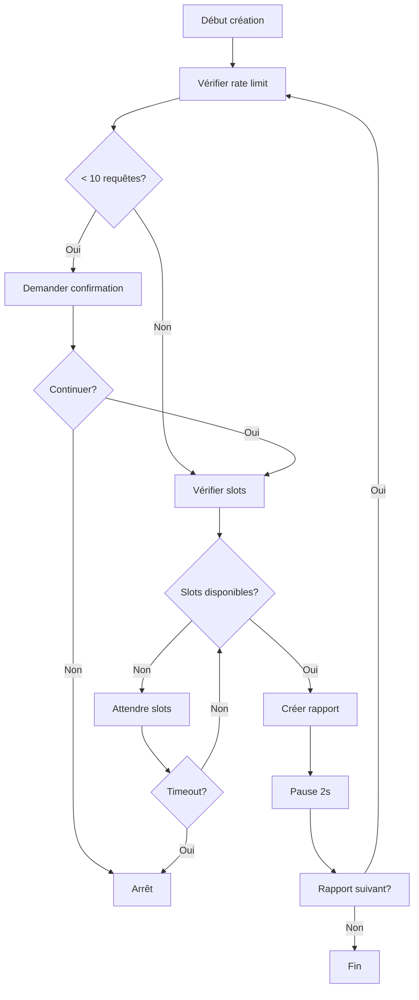

# 🛡️ Contrôles API Qualys - Version 0.3

## Vue d'ensemble

La version 0.3 implémente deux contrôles critiques pour respecter les limitations de l'API Qualys :

1. **Contrôle des slots de rapports** : Maximum 8 rapports en cours simultanément
2. **Contrôle du rate limiting** : Maximum 300 requêtes par heure

## 🚦 Contrôle du Rate Limiting

### Fonctionnement
- **Suivi automatique** via l'en-tête `X-RateLimit-Remaining`
- **Alertes progressives** selon le quota restant
- **Pause automatique** en cas de limitation (HTTP 429)

### Seuils d'alerte
```json
{
  "warning_threshold": 50,    // ⚠️  Avertissement
  "critical_threshold": 10,   // 🛑 Critique
  "pause_on_limit": true      // Pause automatique
}
```

### Comportement
- **> 50 requêtes** : Fonctionnement normal
- **10-50 requêtes** : Avertissement affiché
- **< 10 requêtes** : Demande confirmation utilisateur
- **0 requêtes** : Pause automatique de 60 secondes

## 📊 Contrôle des Slots de Rapports

### Limitation Qualys
- **Maximum** : 8 rapports en statut "Running" simultanément
- **Vérification** : Avant chaque création de rapport
- **Attente intelligente** : Jusqu'à 30 minutes par défaut

### Processus de vérification
1. **Comptage** des rapports en cours via API
2. **Calcul** des slots disponibles (8 - rapports_en_cours)
3. **Attente** si pas assez de slots libres
4. **Affichage** des rapports en cours d'exécution

### Configuration
```json
{
  "max_running_reports": 8,
  "max_wait_for_slots": 1800,     // 30 minutes
  "slot_check_interval": 30,      // 30 secondes
  "pause_between_reports": 2      // 2 secondes
}
```

## 🔧 Utilisation

### Scripts de monitoring

#### Vérifier le statut API
```bash
python scripts/api_monitor.py status
```

#### Attendre des slots libres
```bash
python scripts/api_monitor.py wait 2    # Attendre 2 slots
```

#### Tester la connexion
```bash
python scripts/api_monitor.py test
```

### Dans le code

#### Service de rapports amélioré
```python
from src.services.report_service import ReportService

# Le service vérifie automatiquement les contrôles
report_service = ReportService(qualys_client)
reports = report_service.create_reports_from_selected_scans(scans)
```

#### Vérification manuelle des slots
```python
from src.api.qualys_client import QualysClient

client = QualysClient(api_config)

# Vérifier les slots disponibles
running_count = client.get_running_reports_count()
available = 8 - running_count

# Attendre des slots libres
success = client.wait_for_report_slots(required_slots=2)
```

## 📋 Workflow avec contrôles

### Création de rapports


### Gestion des erreurs
- **Rate limit atteint** : Pause de 60 secondes
- **Pas de slots** : Attente avec vérification périodique
- **Erreur API** : Retry avec backoff exponentiel

## 🎛️ Configuration avancée

### Personnalisation des seuils
```json
{
  "api": {
    "rate_limiting": {
      "warning_threshold": 30,     // Seuil d'avertissement
      "critical_threshold": 5,     // Seuil critique
      "pause_on_limit": false      // Pas de pause auto
    }
  },
  "reports": {
    "creation_controls": {
      "max_wait_for_slots": 900,   // 15 minutes max
      "slot_check_interval": 60,   // Vérifier chaque minute
      "batch_size": 2              // 2 rapports par lot
    }
  }
}
```

### Mode batch intelligent
```python
# Création par lots avec gestion automatique
reports_config = [
    {"type": "scan_based", "scan_id": "123", "template_id": "456"},
    {"type": "host_based", "template_id": "789"}
]

created = report_service.create_reports_with_smart_batching(
    reports_config, 
    batch_size=4
)
```

## 📊 Monitoring et alertes

### Informations affichées
- **Requêtes restantes** : Quota API en temps réel
- **Slots disponibles** : Rapports en cours vs maximum
- **Rapports en cours** : Liste des rapports actifs
- **Temps d'attente** : Estimation pour slots libres

### Recommandations automatiques
- **Quota faible** : Éviter nouvelles créations
- **Pas de slots** : Attendre fin de rapports
- **Optimal** : Création possible

## 🚨 Gestion des situations critiques

### Quota API épuisé
1. **Détection** : X-RateLimit-Remaining = 0
2. **Action** : Pause automatique
3. **Attente** : Jusqu'à réinitialisation (1 heure)
4. **Reprise** : Automatique quand quota disponible

### Tous les slots occupés
1. **Détection** : 8 rapports en cours
2. **Action** : Attente avec monitoring
3. **Affichage** : Liste des rapports actifs
4. **Reprise** : Dès qu'un rapport se termine

### Timeout d'attente
1. **Seuil** : 30 minutes par défaut
2. **Action** : Arrêt avec message explicatif
3. **Recommandation** : Réessayer plus tard

## 💡 Bonnes pratiques

### Planification
- **Heures creuses** : Lancer les gros lots la nuit
- **Surveillance** : Vérifier le statut avant gros traitements
- **Lots réduits** : Préférer plusieurs petits lots

### Optimisation
- **Pause entre rapports** : Éviter la surcharge
- **Vérification préalable** : Toujours checker les slots
- **Monitoring continu** : Utiliser les scripts de suivi

### Récupération d'erreurs
- **Retry automatique** : En cas d'erreur temporaire
- **Logs détaillés** : Pour diagnostic
- **Alertes utilisateur** : Information en temps réel

---

**🎯 Résultat** : Respect garanti des limitations Qualys avec création optimisée des rapports !